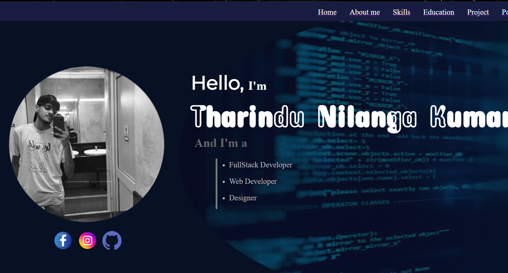
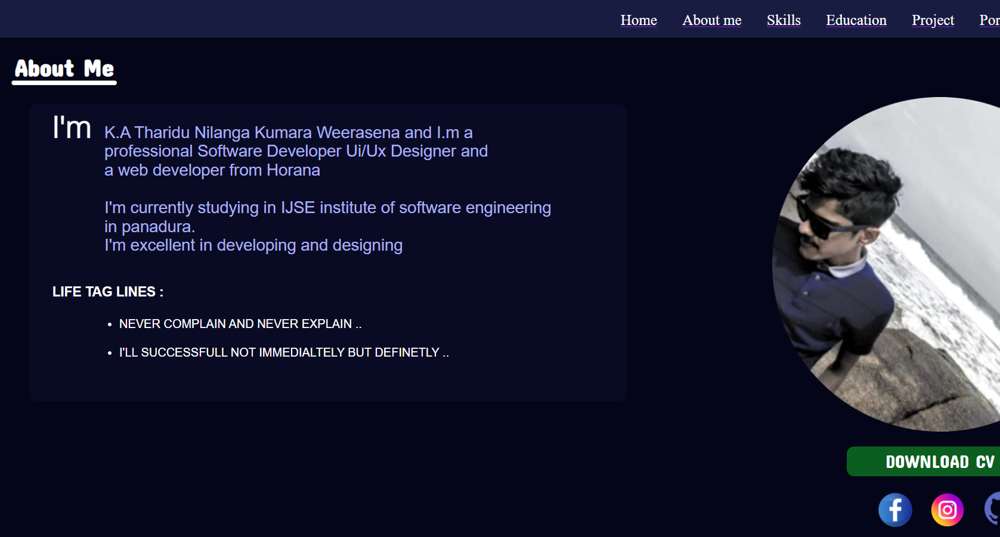
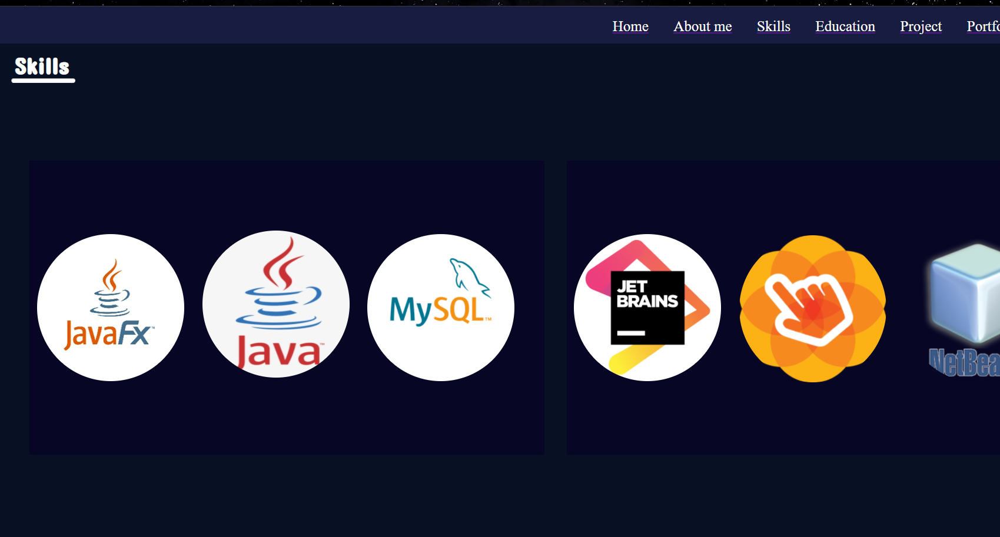
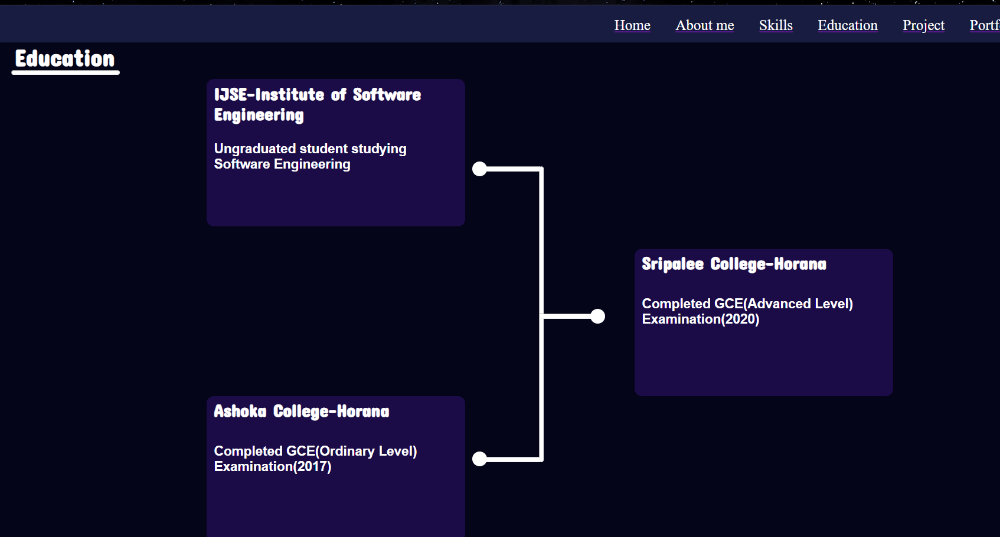
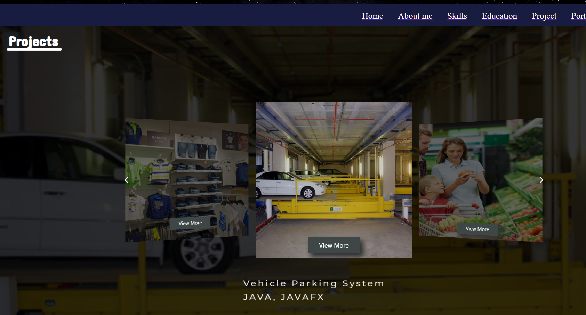
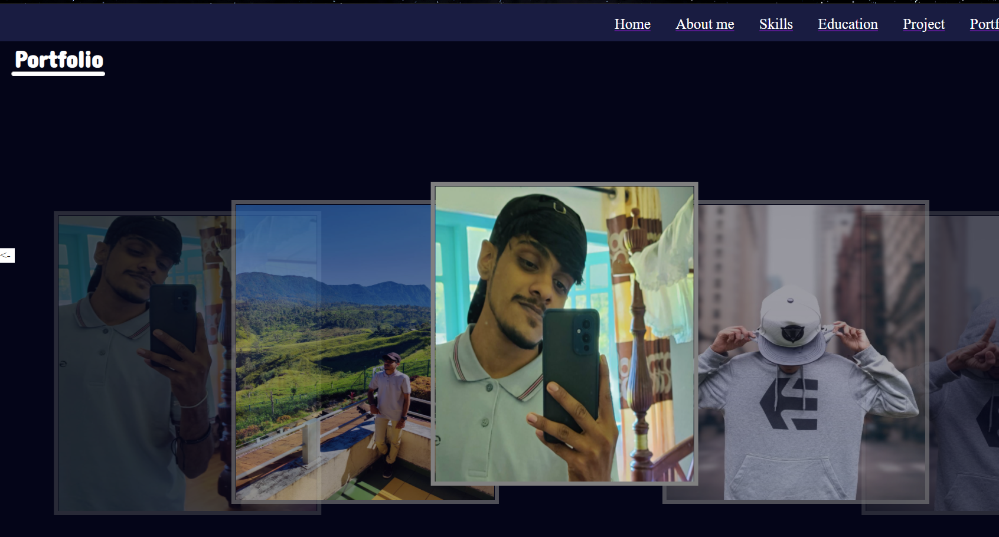
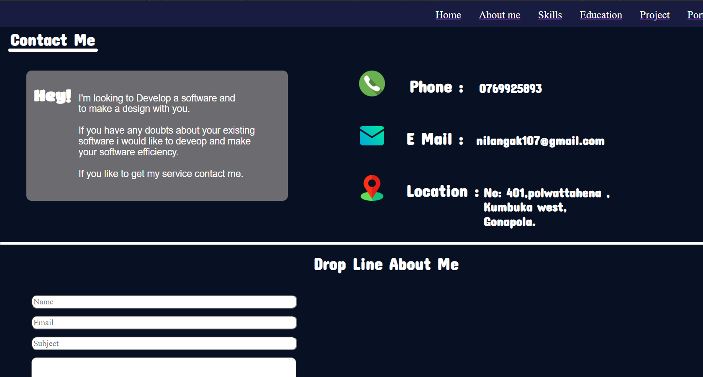

#This is my profile
## I am currently studying in institute of software engineering(IJSE)-Panadura
### This is the direct link of my portfolio github page URL

## <a href="https://tharindunilanga.github.io/MyProfile/" target="_blank">Click Here To Visit</a> :footprints:

### This is the direct link of my portfolio 000WebHost page URL

## <a href="https://tharindunilanga.000webhostapp.com/" target="_blank">Click Here To Visit</a> :footprints:
### This is the direct link of my portfolio website mockup made using Figma

## <a href="https://www.figma.com/file/nIP4z1sWmZ5RId9tjH69x6/Untitled?node-id=0%3A1" target="_blank">Click Here To Visit</a> :footprints:

### This is the direct link of my portfolio website wireframe

## <a href="https://wireframe.cc/sBBDej" target="_blank">Click Here To Visit</a> :footprints:
### This is the direct link of my portfolio website sitemap

## <a href="https://www.gloomaps.com/jKQH3gRlyc" target="_blank">Click Here To Visit</a> :footprints:
### This is the direct link of my linkedIn profile

## <a href="https://www.linkedin.com/in/tharindu-nilanga-093082226/" target="_blank">Click Here To Visit</a> :footprints:

#HOME

#ABOUT ME

#SKILLS

#EDUCATION

#PROJECTS

#PORTFOLIO

#CONTACT ME

batch process